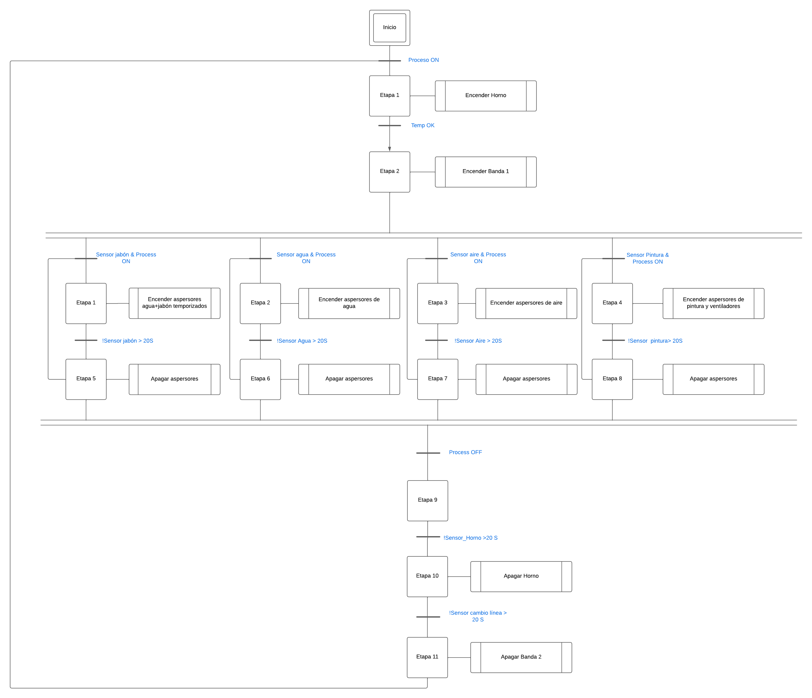
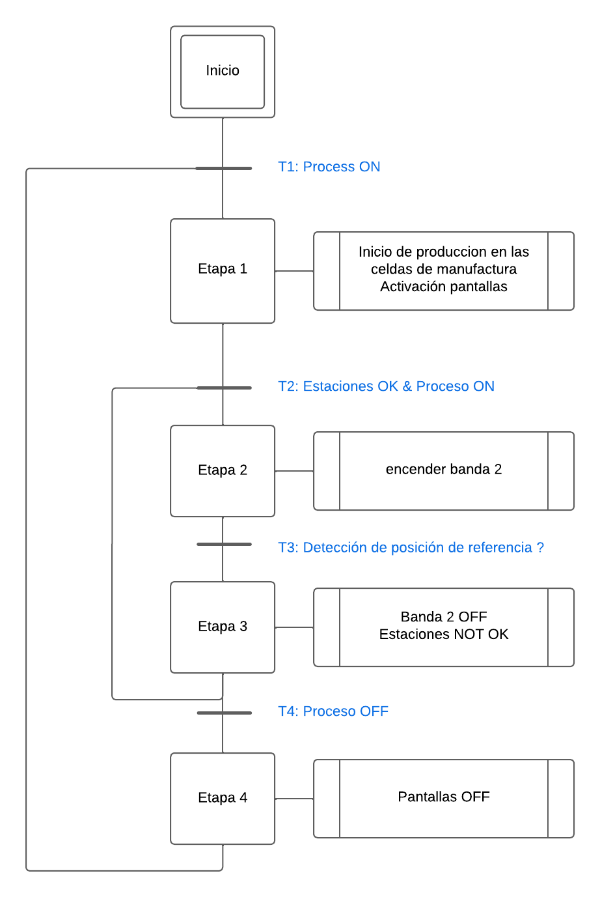

# Modulo de SCADA y Controladores industriales

Para la sección de SCADA y controladores industriales, el proceso se desglosó en dos partes: una correspondiente al **lavado y pintura de los marcos**, y otra al **ensamble de las bicicletas**, referenciadas como **parte 1** y **parte 2**, respectivamente.

La lógica de la parte 1 fue programada en un **PLC S7-1200 de Siemens**, mientras que la lógica de la parte 2 se implementó en un **CompactLogix 5330 ERM de la marca Allen-Bradley**. Para permitir la comunicación entre ambos controladores, se utilizaron **dos módulos SIMATIC IoT2040**, en los cuales se ejecutaba **Node-RED**. La comunicación se estableció mediante el protocolo **MQTT**, permitiendo el intercambio de tags entre los dos sistemas.

Para el servidor MQTT (broker), se utilizó **HiveMQ**, desplegado en la nube a través de un contenedor en **AWS**. Los módulos IoT se suscribían a los tópicos correspondientes y enviaban la información a sus respectivos PLCs.

## Arquitectura de Comunicaciones

En cuanto a la arquitectura de comunicaciones, se plantea conectar los diferentes **sensores ambientales** a los módulos IoT mediante el protocolo **Modbus**, mientras que los **sensores de presencia o conteo** estarán asociados directamente a su respectivo PLC. Toda la información recolectada será enviada a un **servidor MQTT**, centralizando los datos para su monitoreo y análisis.

## Programación PLC SIEMENS S1200

Para la programación del controlador, lo primero que se realiza es un **análisis por etapas (GRAFCET)** de cómo debería funcionar este subproceso.

Como se puede observar, lo primero que se debe hacer al iniciar el proceso es **encender el horno** y esperar a que alcance un **humbral de precalentamiento adecuado**, de manera que, cuando las bicicletas lleguen, ya esté a la temperatura ideal para el curado de la pintura. Una vez se cumple esta condición (**Transición 2**), se procede a **encender la banda 1**, iniciando así el flujo de bicicletas.

Posteriormente, se presenta una **bifurcación de tipo AND**, donde se ejecutan en paralelo cuatro subprocesos: uno por cada subestación de lavado y el de pintura. En estos subprocesos se busca **optimizar el uso de recursos**, de modo que si, por alguna razón, hay un slot o gancho vacío entre bicicletas, los **actuadores correspondientes se apaguen automáticamente** y permanezcan inactivos hasta que se detecte nuevamente una bicicleta.

Esta lógica se **alinea con los principios de Lean Manufacturing**, ya que busca minimizar los **desperdicios operativos**, evitando el uso innecesario de energía o componentes en ausencia de producto. Este enfoque contribuye a una operación más eficiente y sostenible, promoviendo el uso inteligente de los recursos disponibles.

Posteriormente, esta lógica se implementa en lenguaje **LADDER**, considerando que las etapas paralelas tienen asociadas sensores y actuadores individuales. Por ello, se opta por estructurar el programa en **subprocesos separados**.

El programa se compone de tres bloques:

- `MAIN`
- `Automatic`
- `Block_1` (Proceso de variables analógicas)

En el bloque `MAIN`, se llama al bloque que procesa las **entradas analógicas** (`IW64` e `IW66`) y a la función `Automatic`, cuya ejecución se controla mediante un **tag** modificado desde el dashboard de **Node-RED**.

En `Block_1`, las variables analógicas se **normalizan** (conversión de entero a real), teniendo en cuenta los valores máximos indicados en el **datasheet** del banco. Luego, se escalan en un rango aproximado de 0 a 100, y sus valores se almacenan en una **base de datos**, para ser accedidos desde Node-RED.

Finalmente, en el bloque `Automatic`, que contiene la rutina automática del PLC, se programan las condiciones bajo las cuales los **actuadores se energizan**, según las transiciones definidas en el diagrama GRAFCET.

Esta misma lógica se replica para el resto de **actuadores de aire y pintura**, manteniendo la estructura modular del programa.

## Programación PLC CompactLogix 5330

La segunda parte del proceso cuenta con una **línea principal de ensamble**, conectada a diversas **estaciones de subensamble**. La lógica definida establece que la banda transportadora solo puede avanzar si **todas las estaciones de subensamble se encuentran en estado OK**, es decir, que cada una haya completado su proceso satisfactoriamente.

Para esto, se dispone de una **botonera en cada estación**, mediante la cual los operarios indican que la estación está lista. La **detención de la banda** ocurre cuando la bicicleta llega a una **posición de referencia**, es decir, cuando ha alcanzado la siguiente estación de trabajo.

La lógica fue representada mediante un **diagrama GRAFCET**, y a partir de este se desarrolló el control en lenguaje **LADDER**, facilitando su implementación en el PLC CompactLogix.

Se desarrolló también un **esquemático funcional** que describe el comportamiento esperado de los actuadores:

Cabe resaltar que en cada subestación se contempla la presencia de un **monitor industrial**, el cual indica a los operarios qué producto deben ensamblar en ese momento y cuántas unidades restan por producir.

Para más detalles, se recomienda revisar el archivo `.ACD`, en el cual se evidencia de forma más directa la **traducción del GRAFCET a LADDER**, con las siguientes convenciones:
- Variables `T` para transiciones
- Variables `E` para estaciones
- Comunicación con el variador de frecuencia mediante **tags provenientes de Node-RED**

---

## Node-RED y SCADA

Para la comunicación con Node-RED y el sistema SCADA, se desarrollaron **tres flujos principales**:

1. **Supervisión de sensores y máquinas** en la planta de producción.
2. **Supervisión de variables ambientales**, como temperatura, humedad, y partículas en el aire.
3. **Control manual de equipos y actuadores**, desde una interfaz accesible para el operario.

Además, se incluye una **sección de alarmas**, que se activa cuando alguna variable excede los límites preestablecidos.

